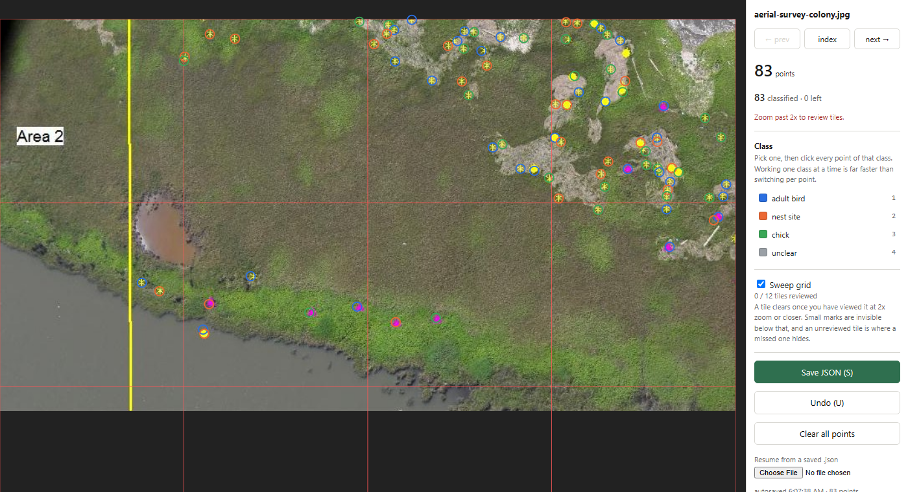

# click-to-label

Point-label images in the browser. No install, no server, nothing uploaded.

`build.py` turns a folder of images into one self-contained HTML page each. Open a page, click on things, press `S`, and a JSON file lands in your downloads.



```bash
python build.py my-images/
# open pages/index.html, label, press S
```

Labelling needs Python 3.8 and a browser. Nothing else. `score.py` also wants numpy.

## Why this exists

I was recovering bird annotations from historical aerial surveys, where the original tool had drawn coloured dots straight into screenshots and never saved the coordinates. My pipeline could find those dots, but the survey data only gave a **count** per image, never a position. So "found 61 dots" against "61 dots present" was the entire measurement available, and that number cannot separate:

- found all 61 markers
- found 40 real ones and invented 21
- found 61, none of them on anything

All three score 61. Precision, recall and placement error were unmeasurable, so I could not tell whether a change helped.

I tried the established annotation tools first. They are built for drawing boxes and polygons across a team, with a server, accounts and a project model. I wanted to click 500 points on eight images, on my own laptop, in an afternoon.

The first frames labelled with this found a bug that had been discarding **27% of every image's real markers** while the count metric read a healthy 1.24x. That is the argument for labelling a small set by hand even when you already have counts.

---

## Usage

### Label a folder

```bash
python build.py photos/
open pages/index.html          # or double-click it
```

One page per image, with prev/next links and an index. Each page carries its own image, so the `pages/` folder works from a USB stick, a zip file, or a `file://` URL with no server running.

### Add classes

```bash
python build.py photos/ --classes classes.json
```

```json
[
  { "name": "adult bird", "color": "#2b6fe0" },
  { "name": "nest site",  "color": "#eb6834" },
  { "name": "chick",      "color": "#3aa757" }
]
```

A bare list of names also works, and colours are assigned for you:

```json
["car", "van", "truck"]
```

Keys `1`–`9` select the first nine classes. Pick one, then click every point of that class across the whole image before moving to the next. That is much faster than choosing a class for each point in turn.

**If two classes share a colour** and differ only in the shape of the marker, a coloured square cannot tell them apart. Point the class at a small image of its own marker instead:

```json
[
  { "name": "nest site", "color": "#eb6834", "glyph": "glyphs/star.png" },
  { "name": "bird",      "color": "#eb6834", "glyph": "glyphs/circle.png" }
]
```

Glyph paths are relative to the JSON file, and get inlined into the page like the images.

### Correct a model instead of starting from nothing

```bash
python build.py photos/ --seeds detections.csv
```

`detections.csv` is `image,x,y[,class]`. Its points appear on the image already placed, so the work becomes deleting the wrong ones and adding what was missed.

Feed it **confident** output, not everything the model produced. A seed set several times larger than the real count costs more to delete than to draw. On one of my frames the union of two detectors gave 1571 seeds against 9 real markers, which was worse than a blank page.

### Keep a blind control

```bash
python build.py photos/ --seeds detections.csv --blind 2
```

Two images get no seeds, chosen spread through the set. Someone shown a model's output tends to confirm it rather than hunt for what it missed, and that quietly inflates recall. Comparing points-per-image on the blind images against the seeded ones is what shows whether it happened.

### Stop and come back

Every click is saved to `localStorage`. Reopen the page and it offers the work back. To move between machines, or to hand an image to someone else, press `S` and load the JSON with **Resume from a saved .json**.

Splitting a set between two people needs no coordination: run `build.py` on each half, or send the same `pages/` folder and agree who takes which images. Each page is independent.

### Score a model

```bash
python score.py labels/ predictions.csv
python score.py labels/ predictions.csv --tol 4
```

```
image                               labels   pred      P      R     F1     err  swept
aerial-survey-colony.jpg                83     95   0.74   0.84   0.79   1.61px  12/12

POOLED over 1 images, tolerance 5px
  precision 0.737   recall 0.843   F1 0.787
  70 matched, 25 false positives, 13 missed
  median placement error 1.61px

CLASS accuracy on 70 matched, class-labelled points: 1.000
```

`predictions.csv` is the same `image,x,y[,class]` format as `--seeds`, so one file feeds both.

Predictions are matched one-to-one, closest first, within `--tol` pixels. The pairing is greedy over a global distance ordering rather than per-prediction nearest, because nearest-first lets two predictions claim the same label and reports a miss and a false positive that are really one duplicate.

Class accuracy is scored only on matched points. Scoring a class on a point the model never found would be measuring detection, not classification.

### Export for training

```bash
python export.py labels/                        # -> labels.csv
python export.py labels/ -o train.csv
python export.py labels/ --boxes 40             # adds xmin,ymin,xmax,ymax
python export.py labels/ --skip-unswept         # drop half-reviewed images
```

`--boxes` writes a square of that side around each point, clipped to the image, for detectors that want boxes. Choose the side from the size of the thing you labelled.

### Tune the sweep grid

```bash
python build.py photos/ --tile 400
```

The grid divides the image into tiles and marks one reviewed once you have viewed it at 2x zoom or closer. Bigger tiles on large images, smaller on small ones. The default of 220px suits images around 800–1500px wide.

---

## Controls

| | |
|---|---|
| **Click** empty space | add a point |
| **Click** a point, class selected | assign that class |
| **Click** a point, no class selected | delete it |
| **Shift+click** | always delete |
| **Drag** / **Wheel** | pan / zoom |
| **1**–**9** | pick a class · **0** clears the selection |
| **N** | jump to the next unclassified point |
| **S** save · **U** undo · **H** hide points | |

## Four things it does deliberately

**Autosaves after every click.** Labelling a busy image takes an hour and a stray refresh should not cost it. State goes to `localStorage` and the page offers it back when you return.

**Tracks a sweep grid.** A tile only clears once you have viewed it at 2x zoom or closer, because small marks are invisible below that and an unreviewed tile is exactly where a missed one hides. Saving with tiles outstanding asks you to confirm, and `score.py` flags those images, because precision measured against a partly-labelled image is a lower bound rather than a result. One of my images gave 100 points labelled at 1x and 103 after re-sweeping at 3x.

**Takes seeds, so the work is correction.** Described above, along with the blind control that keeps it honest.

**Shows the marker, not just a colour.** Two classes that share a colour cannot be told apart by a coloured square in the palette.

## Output

One JSON per image:

```json
{
  "image": "aerial-survey-colony.jpg",
  "width": 880, "height": 470,
  "tiles_total": 12, "tiles_reviewed": 12,
  "seeded": true, "seed_count": 83,
  "points": [ { "x": 412.0, "y": 233.5, "cls": "adult bird" } ]
}
```

`seeded` and `seed_count` record whether the image was a blind control, so an analysis can separate the two groups later.

## Try it

```bash
python build.py examples/images --classes examples/classes.json --seeds examples/seeds.csv
# open pages/index.html
```

Two aerial survey screenshots. The colony image comes pre-seeded with 83 real hand-labelled points, which is what the screenshot above shows. The sparse one has two, so you can see what starting from nearly nothing feels like.

## Files

```
build.py        images -> pages           stdlib only
labeller.html   the page itself           no dependencies
score.py        predictions -> P/R/F1     numpy
export.py       labels -> CSV             stdlib only
```

## What it is not

Not a replacement for CVAT or Label Studio. There are no boxes, no polygons, no masks, no multi-user anything, no review workflow. It labels points, on your own machine, and gets out of the way.

MIT licensed. Built while working on [Recovering Bird Annotations from Historical Airborne Imagery](https://github.com/vickysharma-prog/Recovering-computer-vision-annotations) for Google Summer of Code 2026 with DeepForest / WeeCology.
